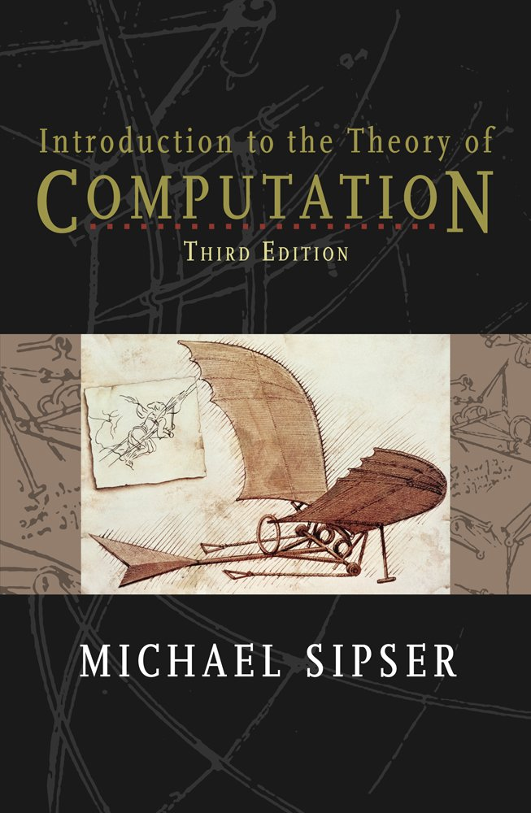

# Excercises and (my) solutions 
for
**[Introduction to the Theory Of Computation](https://www.amazon.com/Introduction-Theory-Computation-Michael-Sipser/dp/113318779X)**
*Prof. Michael Sipser*

-----

Have other solutions or think mine are wrong? Share your thoughts ([open an issue](https://github.com/mharbuz/itttof-exercices/issues/new))! 

-----

## Chapter 0
### [Exercises 0](chapter_00/exercises.md) 
### [Problems 0](chapter_00/problems.md) 
