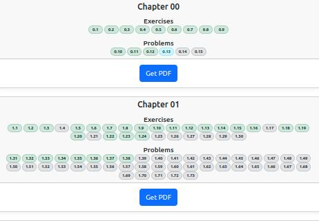
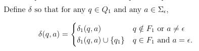
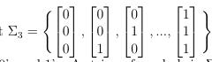

# Excercises and (my) solutions

for
**[Introduction to the Theory Of Computation](https://www.amazon.com/Introduction-Theory-Computation-Michael-Sipser/dp/113318779X)**

---

Have other solutions or think mine are wrong? Share your thoughts ([open an issue](https://github.com/mharbuz/itttoc-exercices/issues/new))!

---

## Table of Contents

**Hi!** Main content of this repo are solutions to exercises from the book presented above.

But, it is also a good example of developer environment to using LaTeX to produce scientific documents with math expressions and graphs. You can check VS Code settings [here](.vscode/settings.json).

Few examples of latex code you can found there:
1. Math expressions: 

2. Math vectors/matrix 

3. Graphs 

4. Colored graphs

Along using LaTeX during content creation process I've prepared [github actions](github/workflows/actions.yml) example to automatic build and publish PDFs from LaTeX documents as well as publishing simple homepage on github pages: [https://mharbuz.github.io/itttoc-exercises/](https://mharbuz.github.io/itttoc-exercises/)

- Simple homepage for this project, hosted on GitHub Pages. <a href="https://mharbuz.github.io/itttoc-exercises/" target="\_blank">HERE</a>
- Visual Studio Code workspace settings for building Latex documents.
- Quite a few examples how to use Latex. Especially for writing graphs.
- Example of GitHub action to build Latex documents and deploy them to GitHub Pages.
