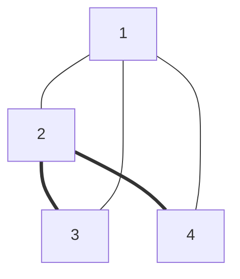
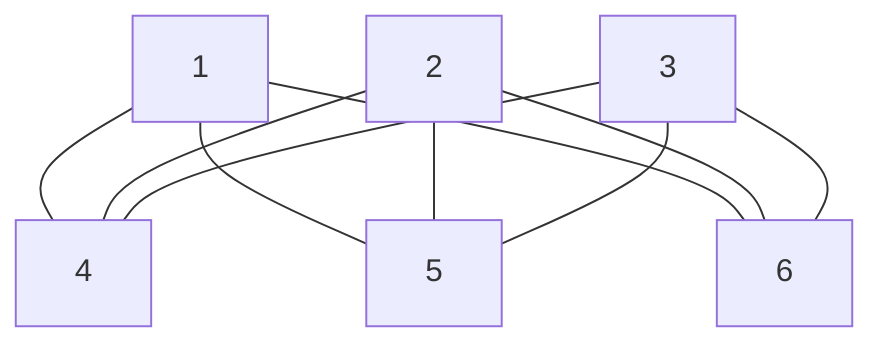

# Chapter 0 - exercises
## 0.1
Examine the following formal descriptions of sets so that you understand which members they contain. Write a short informal English description of each set.
1. $`\{1, 3, 5, 7, \ldots \}`$ 
Set of odd, natural numbers.
1. $`\{x \ldots, -4, -2, 0, 2, 4 \ldots \}`$ 
Set of even, integer numbers.
1. $`\{n \mid n = 2m~\text{for some \textit{m}} \in \mathbb{N} \}`$ 
Set of even, natural numbers.
1. $`\{n \mid n = 2m~\text{for some \textit{m}} \in \mathbb{N}, \text{and}~n~=~3k~\text{for some}~k \in \mathbb{N} \}`$ 
Set of even, natural numbers that are also multiples of 3.
1. $`\{w \mid w~ \text{is a string of \textit{0s} and \textit{1s} and \textit{w} equals the reverse of}~w\}`$ 
Set of strings of 0s and 1s that are palindroms 
1. $`\{ n \mid n~\text{is an integer and}~ n = n+1\}`$ 
Set of integers that are equal to their successor which is <u>empty set</u>
## 0.2
Write  formal descriptions  of the following sets.
1. The set containing the numbers 1, 10, and 100 
    $`\{1, 10, 100\}`$
1. The set containing all integers that are greater than 5 
    $`\{n \mid n > 5, n \in \mathbb{Z}\}`$
1.  The set containing all natural numbers that are less than 5: 
    $`\{n \mid n < 5, n \in \mathbb{N}\}`$
1. The set containing the string "aba": 
    $`\{"aba"\}`$
1. The set containing the empty string: 
    $`\{\epsilon\}`$
1. The set containing nothing at all: 
    $`\emptyset`$
## 0.3
Let $A$ be the set $`\{x,y,z\}`$ and $B$ be the set $`\{x,y\}`$
1. Is $A$ a subset of $B$? ($A \subseteq B$)  
    No, $A$ is not a subset of $B$
1. Is $B$ a subset of $A$? ($B \subseteq A$)  
    Yes, $B$ is a subset of $A$
1. What is the union of $A$ and $B$? ($A \cup B$)  
    $`\{x,y,z\} = A`$
1. What is the intersection of $A$ and $B$? ($A \cap B$)  
    $`\{x,y\} = B`$
1. What is the cross product $A$ and $B$? ($A \times B$)  
    $`\{(x,x), (x,y), (y,x), (y,y), (z,x), (z,y)\}`$
1. What is the power set of $B$? ($\mathcal{P}(B)$)  
    $`\{\emptyset, \{x\}, \{y\}, \{x,y\}\}`$

## 0.4
If $A$ has  $a$  elements and  $B$  has  $b$  elements, how many elements are in  $A \times B$? 
Explain your answer.  
The cross product of two sets $A$ and $B$ is the set of all possible ordered pairs of elements from $A$ and $B$. If $A$ has $a$ elements and $B$ has $b$ elements, then the cross product $A \times B$ will have $a \cdot b$ elements.

## 0.5
If $C$ is a set with $c$ elements, how many elements are in the power set of $C$? 
Explain your answer.  
The power set of a set $C$ is the set of all possible subsets of $C$. If $C$ has $c$ elements, then the power set of $C$ will have $2^c$ elements.

## 0.6
Let X be the set $\{1, 2, 3, 4, 5\}$ and $Y$ be the set $\{6, 7, 8, 9, 10\}$. The unary function $f: X \to Y$ and the binary function $g: X \times Y \to Y$ are described in the following tables.

| n | f(n)| 
|---|---|
|1 |6 |
|2 |7 |
|3 |6 |
|4 |7 |
|5 |6 |

|g |6 |7 |8 |9 |10 |
|---|---|---|---|---|---|
|1 |10 |10 |10 |10 |10 |
|2 |7 |8 |9 |10 |6 |
|3 |7 |7 |8 |8 |9 |
|4 |9 |8 |7 |6 |10 |
|5 |6 |6 |6 |6 |6|

1. What is the value of f(2)?  
    $f(2) = 7$
1. What are the range and domain of f?
    - Range: $\{6, 7\}$
    - Domain: $\{1, 2, 3, 4, 5\}$
1. What is the value of g(2, 10)? 
    $g(2, 10) = 6$
1. What are the range and domain of g? 
    - Range: $\{6, 7, 8, 9, 10\}$
    - Domain: $\{1, 2, 3, 4, 5\}$
1. What is the value of g(4, f(4))? 
    $g(4, f(4)) = 8$

## 0.7
For each part, give a relation that satisfies the condition.
1. Reflexive and symmetric but not transitive.
1. Reflexive and transitive but not symmetric.
1. Symmetric and transitive but not reflexive.

Reflexive relation $R$ is when $`\forall a \in A, \ (a, a) \in R`$

Symmetric relation $R$ is when $`\forall a, b \in A, \ (a, b) \in R \implies (b, a) \in R`$

Transitive relation $R$ is when $`\forall a, b, c \in A, \ (a, b) \in R \land (b, c) \in R \implies (a, c) \in R`$

1. Reflexive and symmetric but not transitive example is be coworker relation on the set of people (let's assume that everybody is a coworker with themselves)
1. Reflexive and transitive but not symmetric example is greater than or equal to relation on the set of natural numbers
1. Symmetric and transitive but not reflexive example is the relation "is a sibling of" on the set of people
## 0.8
Consider the undirected graph $G = (V, E)$ where $V$, the set of nodes, is $\{1, 2, 3, 4\}$ and $E$, the set of edges, is $\{\{1, 2\}, \{2, 3\}, \{1, 3\}, \{2, 4\}, \{1, 4\}\}$. Draw the graph $G$. What are the degrees of each node? Indicate a path from node 3 to node 4 on your drawing of $G$.

## 0.9
Write a formal description of the following graph.

$`G = (V, E)`$ where 

$`V = \{1, 2, 3, 4, 5, 6\}`$ and $`E = \{\{1, 4\}, \{1, 5\}, \{1, 6\}, \{2, 4\}, \{2, 5\}, \{2, 6\}, \{3, 4\}, \{3, 5\}, \{3, 6\}\}`$
