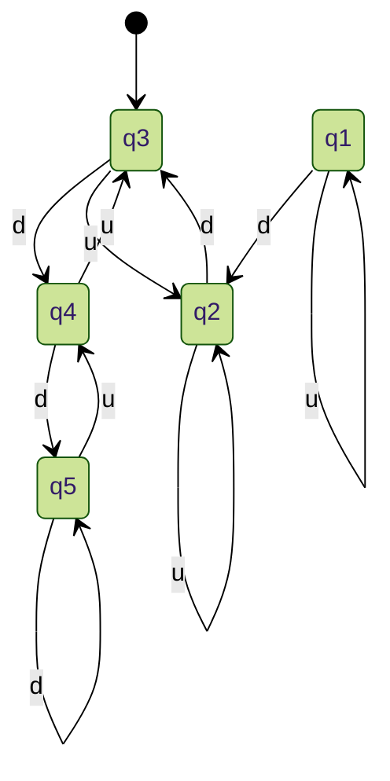

# Chapter 1 - exercises
## 1.1
## 1.2
## 1.3

```mermaid
%%{init: {'theme':'forest'}}%%
stateDiagram-v2
    [*] --> q3
    q1 --> q2: d
    q1 --> q1: u
    q2 --> q3: d
    q2 --> q2: u
    q3 --> q4: d
    q3 --> q2: u
    q4 --> q3: u
    q4 --> q5: d
    q5 --> q5: d
    q5 --> q4: u
```
